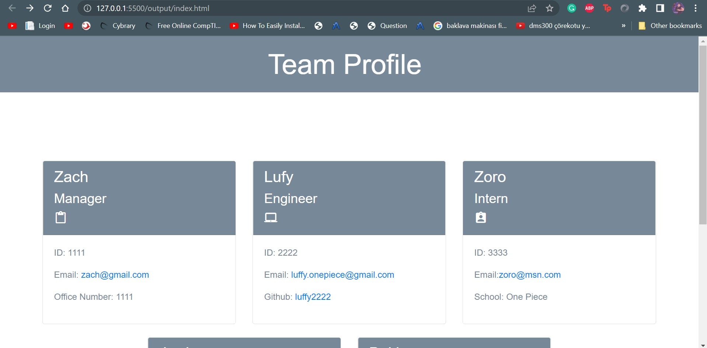

# 10 Object-Oriented Programming: Team Profile Generator
The Inquirer module from Node.js was used to develop this application, which generates a team profile based on user input and displays the data on a freshly created html page with a style sheet. 

## User Story

```md
AS A manager
I WANT to generate a webpage that displays my team's basic info
SO THAT I have quick access to their emails and GitHub profiles
```


## Mock-Up

The following image shows the generated HTML’s appearance and functionality. The styling in the image is just an example, so feel free to add your own styles:




```bash
node index.js
```


```md
.
├── __tests__/             // tests
│   ├── Employee.test.js
│   ├── Engineer.test.js
│   ├── Intern.test.js
│   └── Manager.test.js
├── dist/                  // rendered output (HTML) and CSS style sheet
├── lib/                   // classes
├── src/                   // template helper code
├── .gitignore             // indicates which folders and files Git should ignore
├── index.js               // runs the application
└── package.json
```

